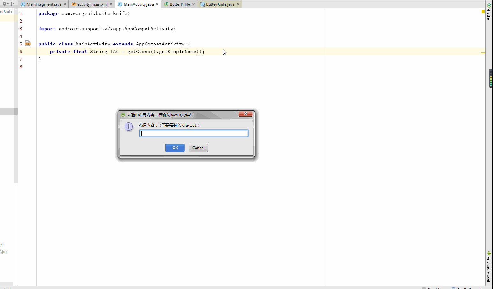
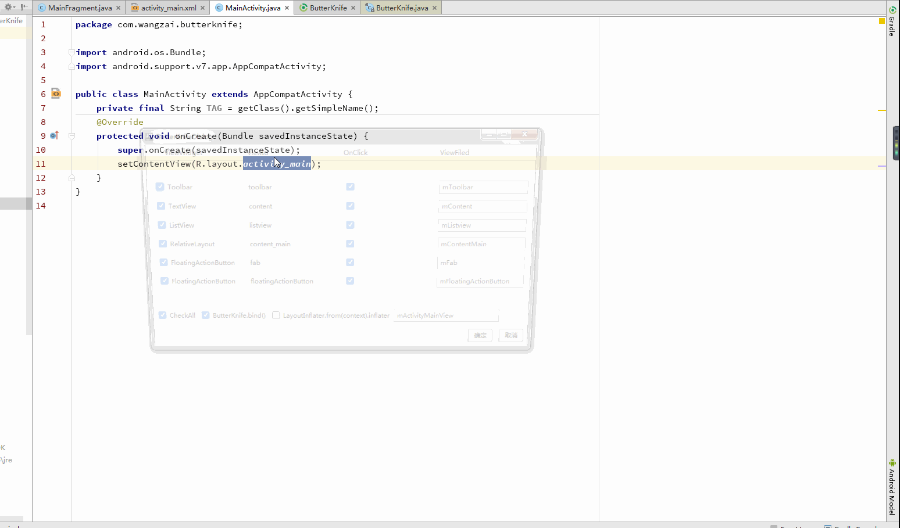

# GenerateFindViewById

## 演示
FindViewById


ButterKnife




## 更新
- 1.4.2 Fix bugs with the same xml name for more than one Module.
- 1.4.1 Code replace to Kotlin, add Forced Casts option, default true, and Replace code to Kotlin language.[Revision 26.0.0 Beta 1 Important changes](https://developer.android.google.cn/topic/libraries/support-library/revisions.html#26-0-0-beta1)
- 1.4 Variable names only support mAaBbCc and aaBbCc naming formats, The switch block adds the default statement.[Alibaba Java Coding Guidelines](https://github.com/alibaba/p3c)
- 1.3 Variable names support three naming formats: 1, mAaBbCc, 2, aa_bb_cc, 3, aaBbCc
- 1.2.2 Onclick can select all or deselect all
- 1.2.1 Fix ImageView and TextView can not click the OnClick option
- 1.2 Support ViewHolder
- 1.1.2 Button defaults to the OnClick option
- 1.1 Support ButterKnife, version 8.4.0, shortcut keys Ctrl+Alt+Shift+E
- 1.0 Support Activity and Fragment, shortcut keys Ctrl+Alt+E


## 安装
- 下载项目里面的`GenerateFindViewById.ja`r包，然后打开AS的Plugins，点击`Install plugin from disk...`安装
- 打开AS的Plugins，点击`Browse repositories...`然后搜索`GenerateFindViewById`，然后安装

## 快捷键
- FindViewById：`Ctrl+Alt+E`
- ButterKnife：`Ctrl+Alt+Shift+E`

## 说明
- 可输入布局字段，可选中布局文件字段，自动生成有id控件相应的代码
- `Activity`如果没有`onCreate`方法，会先生成`onCreate`方法，再重新操作一次才生成有id控件相应的代码。
- `Fragment`如果没有`onCreateView`方法，会先生成`onCreateView`方法，再重新操作一次才生成有id控件相应的代码。
- 可选生成的字段，可编辑变量名，可选择是否`LayoutInflater`类型。
- `LayoutInflater`类型生成的变量规则，如`LayoutInflater`的变量为`mView`，生成控件变量后面会加上`View`。

## 用法
1. 新建`Activity`或者`Fragment`后，选中布局按下快捷键`Alt+Insert`,然后选择`FindViewById`或者在菜单栏中的`Code`中选择`FindViewById`,或者直接使用快捷键`Ctrl+Alt+E`
2. 如果没有选中布局，会弹出输入框，输入布局，插件会自动遍历布局列出所有带id的控件
3. 会自动检测是否已有代码，可选择是否生成、是否生成`OnClick`代码，可编辑变量名
4. 可选择是否生成`View view = LayoutInflater.from(context).inflater()`代码，可编辑生成的`View`的变量名
5. 点击确认生成

## ButterKnife用法
1. 新建`Activity`或者`Fragment`后，选中布局按下快捷键`Alt+Insert`,然后选择`ButterKnife`或者在菜单栏中的`Code`中选择`ButterKnife`,或者直接使用快捷键`Ctrl+Alt+Shift+E`
2. 如果没有选中布局，会弹出输入框，输入布局，插件会自动遍历布局列出所有带id的控件
3. 会自动检测是否已有代码，可选择是否生成、是否生成`OnClick`代码，可编辑变量名
4. 可选择是否生成`View view = LayoutInflater.from(context).inflater()`代码，可编辑生成的`View`的变量名
5. 点击确认生成

## 规则
1. `Activity`如果没有`onCreate`方法，会先生成`onCreate`方法，`Fragment`如果没有`onCreateView`方法，会先生成`onCreateView`方法
2. 没有id的控件是不会识别到的
3. 识别到的控件变量名为`mAaBbCc`命名
4. 识别到的控件中有`clickable = true`属性，自动生成`setOnClickListener`代码和`onClick`方法
5. 识别到的控件`ButterKnife`都可以生成到`onClick`方法
6. 自动识别布局中的`include`标签, 读取对应布局中的控件
7. 识别到的控件中有`text`或者`hint`属性，会自动生成里面的值到字段注释
8. `LayoutInflater`生成的变量名规则为`mAaBbCc+View`的变量名(如`mView`会去掉`m`)
9. `ButterKnife`生成的`LayoutInflater`是`ButterKnife.findById()`来替换`view.findViewById()`

## License
```
Copyright 2016 Jowan

Licensed under the Apache License, Version 2.0 (the "License");
you may not use this file except in compliance with the License.
You may obtain a copy of the License at

	http://www.apache.org/licenses/LICENSE-2.0

Unless required by applicable law or agreed to in writing, software
distributed under the License is distributed on an "AS IS" BASIS,
WITHOUT WARRANTIES OR CONDITIONS OF ANY KIND, either express or implied.
See the License for the specific language governing permissions and
limitations under the License.
```